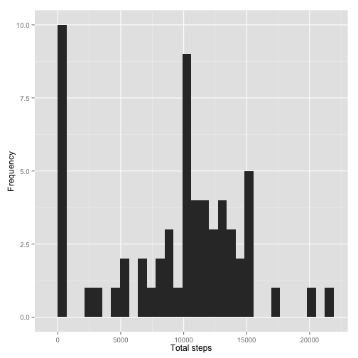
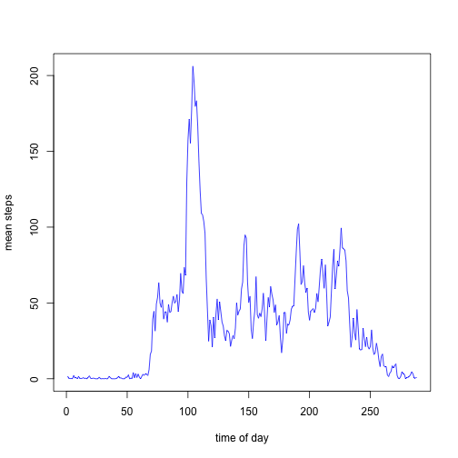
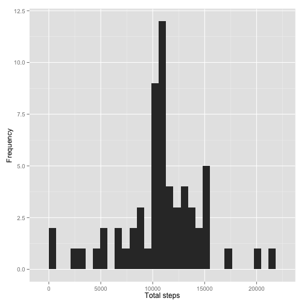

Reproducible Research: Peer Assignment #1
========================================================

Load the data:
---------------


```r
if (!file.exists("activity.csv")) {
    unzip("activity.zip")
}
activity<-read.csv("activity.csv", stringsAsFactors = FALSE)
str(activity)
```

```
## 'data.frame':	17568 obs. of  3 variables:
##  $ steps   : int  NA NA NA NA NA NA NA NA NA NA ...
##  $ date    : chr  "2012-10-01" "2012-10-01" "2012-10-01" "2012-10-01" ...
##  $ interval: int  0 5 10 15 20 25 30 35 40 45 ...
```

What is the total number of steps taken per day?
----------------------------------------------------

```r
totsteps<- tapply(activity$steps, activity$date, sum, na.rm=TRUE)
```

What are the mean and median steps taken?
----------------------------------------------------

```r
mean(totsteps)
```

```
## [1] 9354
```

```r
median(totsteps)
```

```
## [1] 10395
```

Make a histogram of the steps taken:
----------------------------------------------------

```r
require("ggplot2")
```

```
## Loading required package: ggplot2
```

```r
qplot(totsteps, xlab = "Total steps", ylab = "Frequency")
```

```
## stat_bin: binwidth defaulted to range/30. Use 'binwidth = x' to adjust this.
```

 

What is the average daily activity pattern?
----------------------------------------------------

```r
meansteps<- tapply(activity$steps, activity$interval, mean, na.rm=TRUE)
```

Plot the daily average activity pattern:
--

```r
plot(meansteps, type="l", col="blue", xlab="time of day", ylab="mean steps")
```

 

Imputing missing values:
----------------------------------------------------
Lets determine how many step values are missing
--

```r
summary(activity$steps)
```

```
##    Min. 1st Qu.  Median    Mean 3rd Qu.    Max.    NA's 
##     0.0     0.0     0.0    37.4    12.0   806.0    2304
```

Lets use the Hmisc package to impute th missing step values and create a new column for this infomation:
--

```r
require(Hmisc)
```

```
## Loading required package: Hmisc
```

```
## Warning: package 'Hmisc' was built under R version 3.1.2
```

```
## Loading required package: grid
## Loading required package: lattice
## Loading required package: survival
## Loading required package: splines
## Loading required package: Formula
```

```
## Warning: package 'Formula' was built under R version 3.1.1
```

```
## 
## Attaching package: 'Hmisc'
## 
## The following objects are masked from 'package:base':
## 
##     format.pval, round.POSIXt, trunc.POSIXt, units
```

```r
activityimp<- activity
activityimp$steps <- with(activityimp, impute(steps, mean))
str(activityimp$steps)
```

```
## Class 'impute'  atomic [1:17568] 37.4 37.4 37.4 37.4 37.4 ...
##   ..- attr(*, "imputed")= int [1:2304] 1 2 3 4 5 6 7 8 9 10 ...
```

Lets use tapply function to get the imputed total steps
--

```r
totstepsimp<-tapply( activityimp$steps,  activityimp$date, sum)
```

Compare previous mean and median total steps with mean and median total imputed steps data:
--

```r
mean(totsteps)
```

```
## [1] 9354
```

```r
mean(totstepsimp)
```

```
## [1] 10766
```

```r
median(totsteps)
```

```
## [1] 10395
```

```r
median(totstepsimp)
```

```
## [1] 10766
```

Make a histogram of the imputed steps data:
----------------------------------------------------

```r
qplot(totstepsimp, xlab = "Total steps", ylab = "Frequency")
```

```
## stat_bin: binwidth defaulted to range/30. Use 'binwidth = x' to adjust this.
```

 

Are there differences in activity patterns between weekdays and weekends?
--------------------------------------------------------------------------
Create Subsets for weekends and weekdays:
First let's change the imputed date and time data into something cleaner using as.POSIXct
--


```r
activityimp$date.time<-as.Date(activityimp$date, "%Y-%m-%d")
```


```r
weekend <- subset(activityimp, weekdays(activityimp$date.time) %in% c("Saturday", "Sunday"))

weekdays <- subset(activityimp, weekdays(activityimp$date.time) %in% c("Monday", "Tuesday", "Wednesday","Thursday", "Friday"))

weekendsteps<-tapply(weekend$steps, weekend$interval, mean)
weekdaysteps<-tapply(weekdays$steps, weekdays$interval, mean)
```

Plot the weekend and weekday steps:
---

```r
par(mfrow=c(1,2)) 
plot(weekdaysteps, type="l", ylab="Number of Steps", xlab="Interval", main="Weekday Steps")
plot(weekendsteps, type="l", ylab="Number of Steps", xlab="Interval", main="Weekend Steps")
```

 


